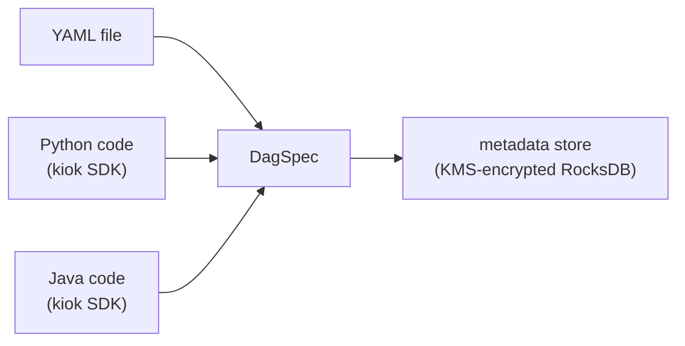

# Authoring DAGs

A **DAG** (directed acyclic graph) is a workflow: a set of tasks plus the dependency edges between them. kiok lets you author the *same* DAG three ways — YAML, Python code, or Java code — and all three compile to one internal definition, the `DagSpec`.

## Three authoring formats, one model



Whichever format you choose, kiok validates the result (no cycles, no dangling `requires`, valid cron, non-empty task bodies) and stores the compiled `DagSpec`. The scheduler, the worker driver, and the admin UI all work off that single representation — they never see the original YAML/Python/Java.

## YAML

The most direct format. A `dag:` header and a `tasks:` list:

```yaml
dag:
  id: daily_etl
  schedule: "0 2 * * *"   # optional 5-field cron; omit for manual-only
  catchup: false
tasks:
  - id: extract
    type: shell
    script: |
      #!/bin/bash
      echo extracting
  - id: load
    type: shell
    requires: [extract]
    script: |
      #!/bin/bash
      echo loading
```

## Python

For a workflow whose shape is *computed* rather than hand-written, author it in Python with the kiok Python SDK. Every module-level `Dag` instance becomes a registered DAG:

```python
from kiok import Dag

REGIONS = ["us-east", "us-west", "eu-central", "ap-south"]

dag = Dag("regional_etl", schedule="0 3 * * *")
dag.task("setup", script="#!/bin/bash\necho prepare")

# fan-out: one branch per region — a loop, not copy-pasted blocks
transforms = []
for r in REGIONS:
    key = r.replace("-", "_")
    dag.task("extract_" + key, requires=["setup"],
             script="#!/bin/bash\necho pull %s" % r)
    dag.task("transform_" + key, task_type="python", requires=["extract_" + key],
             script="print('normalize %s')" % r)
    transforms.append("transform_" + key)

# fan-in: the dependency list is computed
dag.task("merge", requires=transforms, script="#!/bin/bash\necho merge")
```

kiok compiles a Python DAG by running `python3 -m kiok.compile <file>`, which imports the module and emits each `Dag` as a `DagSpec`.

## Java

For type-safe authoring with IDE support and compile-time checking, implement the `KiokDag` interface with the kiok Java SDK. kiok batch-compiles every `.java` source it finds in a git repo or bundle zip — no separate build step on the operator side — loads every `KiokDag` class, and calls `define()`:

```java
public class DailyEtlDag implements KiokDag {
    @Override
    public Dag define() {
        Dag dag = new Dag("daily_etl").schedule("0 2 * * *");
        dag.task("extract")
           .shell("#!/bin/bash\necho extracting");
        dag.task("load").requires("extract")
           .shell("#!/bin/bash\necho loading");
        return dag;
    }
}
```

The `Dag` and `Task` builders are fluent, and a loop over a list builds a fan-out graph exactly as the Python example does.

### Credentials in code — the `Conn` helper

A Java DAG references a stored connection's properties with the `Conn` helper, matching the Python `conn(id, key)` and YAML `${conn.<id>.<key>}` forms — the resolver substitutes the real value in-memory at task-exec time, so the source code itself stays free of secrets:

```java
import com.cloudcheflabs.kiok.sdk.Conn;

dag.task("dump")
   .shell("psql -U \"" + Conn.ref("analytics_db", "username") + "\" "
        + "-d analytics -c 'COPY users TO STDOUT'");
```

`Conn.ref("id", "key")` returns the literal `${conn.id.key}` reference string; `Conn.secret("name")` is the standalone-secret shorthand. See [Connections](connections.md).

### How the source compile works

The kiok leader runs the JDK's in-process `javax.tools.JavaCompiler` against the kiok SDK already on its own classpath, so a user-authored `.java` DAG needs no build configuration on the repo side. Multiple sources are compiled in one javac invocation, so cross-file references (a DAG class importing a helper from a sibling file) resolve naturally.

The original `.java` text is what the admin UI's **Source** tab shows for that DAG, with the resulting `DagSpec` (what the scheduler actually executes) rendered just below it.

## Why code over YAML

YAML is declarative and perfect for a fixed, hand-sized workflow. Code wins when the DAG is *generated*:

- **Loops** — produce N parallel branches from a list instead of copy-pasting N YAML blocks.
- **Computed dependencies** — a fan-in task's `requires` list is built from data, so adding an upstream needs no edit at the fan-in.
- **Abstraction** — a helper function/method defines a task group once and reuses it.
- **Type safety (Java)** — a typo'd task id or dependency fails at compile time, before the DAG reaches the cluster.

## DAG identity

Every DAG has a human-facing **name** (the `id` you write — need not be unique) and a globally-unique **id** derived from where it came from:

- **manual** → the name itself.
- **git** → `<repo>/<source path>` slugified.
- **bundle** → `<bundle name>/<source path>` slugified.

So two DAGs may share a name as long as they originate from different repos or bundles. Run history is keyed by the unique id, so re-pushing the same DAG file continues its existing history.

## Getting DAGs into the cluster

- **Manual** — register a single YAML/Python/Java DAG via the admin UI or `submit.sh register`.
- **Git Sync** — the leader pulls DAGs from git repositories on an interval. See [Git Sync](git-sync.md).
- **Bundles** — upload a zip of DAG definitions for air-gapped clusters. See [DAG Bundles](bundles.md).
