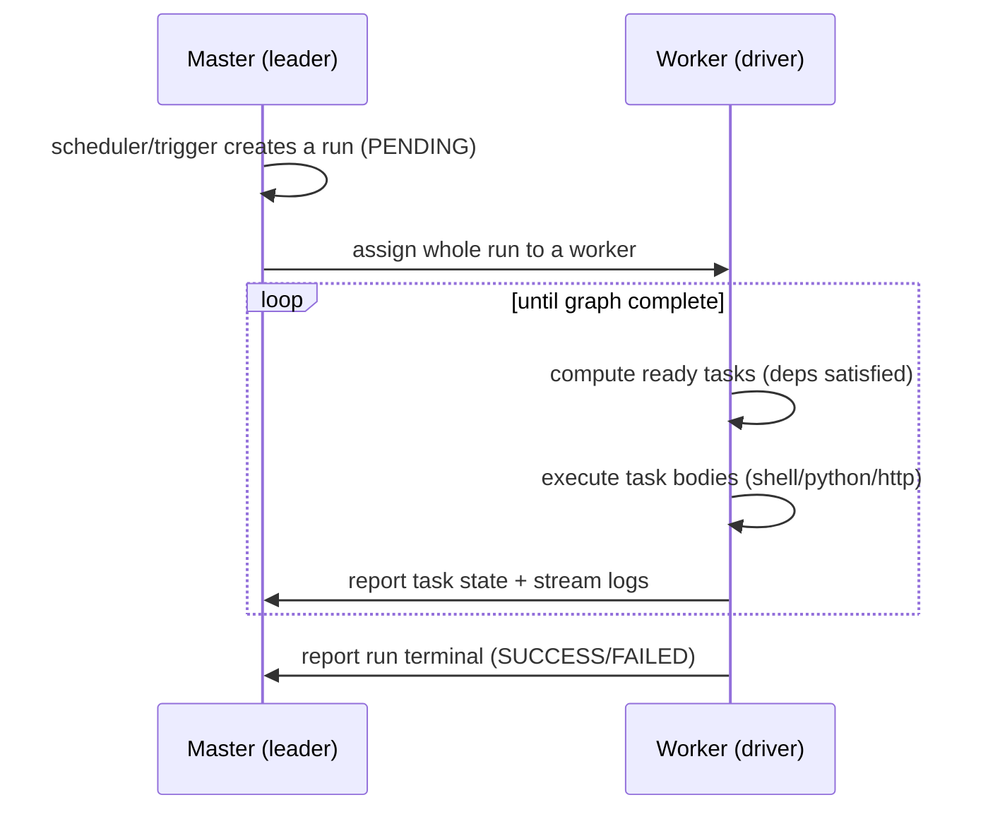

# Worker-Driver Execution

kiok runs a DAG with a **worker-driver** model: the leader Master is the logical coordinator, and one Worker becomes the *driver* of each run — it both walks the graph and executes the tasks.

## How a run executes

1. The scheduler or a manual trigger creates a run in state `PENDING`.
2. The leader's **task coordinator** assigns the entire run to one Worker — its driver.
3. The driver walks the DAG: it computes which tasks are *ready* (every upstream dependency succeeded), dispatches them into its local task slots, and runs the task bodies.
4. As tasks finish, the driver reports task state back to the leader and streams stdout/stderr.
5. When every task reaches a terminal state, the driver reports the run terminal.

Assigning the *whole run* to one driver — rather than scheduling each task centrally — keeps graph-walking decisions local and cheap, and keeps the leader off the per-task hot path.

## Task slots

Each Worker advertises a fixed number of **task slots** (`kiok.worker.task.slots`, default 8) — the number of task bodies it will run concurrently. A driver dispatches ready tasks into its slots; when the graph has more ready tasks than free slots, the rest queue.

Add Workers to raise total execution capacity. The leader spreads runs across Workers, so more Workers means more runs driven in parallel.

## Driver failover

A driver Worker can die mid-run — crash, host failure, network partition. The leader's task coordinator tracks Worker health (`kiok.worker.health.*`); when a driver is declared dead:

1. The coordinator detects the run has lost its driver.
2. The run is reassigned to a healthy Worker.
3. The new driver resumes the graph from the run's last reported state — completed tasks are not re-run.

Failover needs no operator action. A run survives any single Worker loss as long as one healthy Worker remains.

## Timeouts

Each task has an execution timeout — `timeoutMs` on the task, the DAG default, or the cluster default (`kiok.scheduler.default.task.timeout.ms`, 30 min). A task that exceeds it is killed and marked `FAILED`, and the run fails fast rather than hanging.

## Failure semantics

If a task fails, its downstream tasks (which `require` it) cannot become ready, so they are skipped and the run ends `FAILED`. Tasks on independent branches still run to completion. The run's job list and graph view show exactly which task failed and why.
