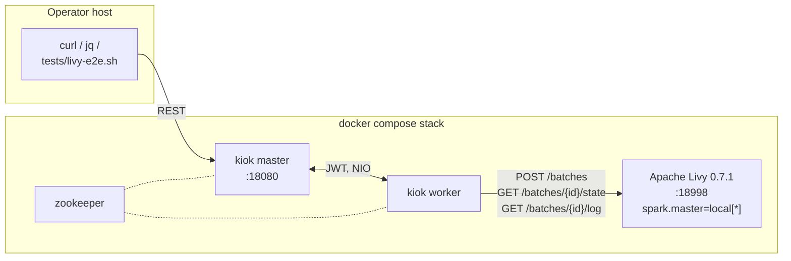

# Spark via Apache Livy

This tutorial drives a kiok cluster end-to-end through Apache Livy's REST batch
API. You will:

- Spin up a single `docker compose` stack that runs **kiok master + worker +
  Livy + Spark** together (Livy embeds Spark in `local[*]` mode so you do not
  need a separate Spark cluster for the walkthrough).
- Author the same Livy task **three times** — YAML, Python SDK, Java SDK — and
  confirm all three produce the same `DagSpec`.
- Submit the canonical PySpark `pi.py` workload through kiok's Livy operator,
  trigger a run, and watch the **live Spark log** stream into the kiok
  admin UI / log API (every `INFO TaskSetManager … (5/10)` line, the final
  `Pi is roughly 3.14…`, the `SparkContext is stopping`, …).
- Kill the kiok worker container mid-run and confirm the same Livy batch is
  **resumed** by the next worker process — no duplicate submit to Livy, the
  log picks up where it left off, and the run still terminates `SUCCESS`.
- Point the same task at an **external** Spark cluster (YARN / standalone /
  Kubernetes) by changing two lines of YAML.

The Livy operator is the right fit when you already run a managed Spark
service (EMR, Cloudera Data Engineering, an in-house Livy gateway, the
"Spark gateway" on Dataproc / HDInsight, …). Compared to the
[Spark + Iceberg via SSH-to-Master](spark-iceberg-via-ssh.md) tutorial it
trades the SSH-and-tail-stdout pattern for a typed REST contract: the kiok
worker `POST`s a batch, polls its state by ID, pages through the per-batch
log endpoint, and surfaces every line into the same kiok task-log view.

| Format | File | DAG name |
|---|---|---|
| YAML | `src/main/script/livy_pi_dag.yaml` | `livy-pi-yaml` |
| Python SDK | `src/main/python/livy_pi_dag.py` | `livy-pi-python` |
| Java SDK | `src/main/java/com/cloudcheflabs/dags/LivyPiJavaDag.java` | `livy-pi-java` |

## Why Livy instead of shelling out to `spark-submit`?

`spark-submit` over SSH (see the [SSH-to-Master tutorial](spark-iceberg-via-ssh.md))
is the right pattern when the kiok worker host and the Spark cluster have a
trust relationship and you want the Worker's stdout to BE the spark-submit
output. Livy fits a different shape:

- Spark cluster is managed (EMR, Dataproc, in-house gateway) — you do **not**
  have shell access to a Spark master and cannot expose one over SSH.
- You want a typed external job identity (`livy.batch.id = 42`) instead of a
  PID — for audit, for kill-by-id from outside kiok, for cross-system tracking.
- You want kiok to survive a worker restart **without re-submitting the Spark
  job** — Livy persists the batch on the gateway side, so kiok just needs to
  re-attach to the same batch id and keep polling.

The kiok Livy operator is purpose-built for these three properties.

## What you need before starting

Versions used in this walkthrough (the docker-compose stack pins all of them):

| Component | Version | Notes |
|---|---|---|
| Apache Livy | **0.7.1-incubating** | the last published Apache release; Spark 3.x batch sessions work even though Livy was built against Spark 2.x — only the interactive REPL mode is incompatible |
| Apache Spark | **3.5.3** | Hadoop 3.3.4 build, Scala 2.12 |
| JDK (inside Livy container) | **Temurin 11 (jammy)** | `eclipse-temurin:11-jre-jammy` |
| Python (for PySpark) | **3.10.12** | Ubuntu 22.04 default; PySpark 3.5 supports 3.8–3.12. **Do not use Ubuntu 24.04 noble (python 3.14) — pickle breaks** |
| Hadoop client | **3** | inside the Spark distribution |

Other prerequisites:

- A host with Docker (Engine ≥ 27, Compose v2). The stack needs roughly **3 GiB
  RAM** and a couple of free CPUs.
- The kiok distribution built locally — `./package.sh` from the kiok repo root
  produces `build/kiok-1.0.0-SNAPSHOT.tar.gz` plus the matching image input.
- `bash`, `curl`, `jq`, `python3` on the operator's machine.

Set `$KIOK` and `$KTOK` from the
[Tutorials index](index.md#prerequisites-common-to-every-tutorial) — this
tutorial assumes the e2e stack below, so set:

```bash
export KIOK=http://localhost:18080      # the e2e stack remaps 8080 → 18080
export LIVY=http://localhost:18998      # 8998 → 18998
# $KTOK is fetched in Step 3 after rotating the default admin password.
```

The cluster topology this tutorial assumes:



## Step 1 — Build the Livy image and bring the stack up

The Livy image is small (one Spark download, one Livy zip) but it is built
from source inside `kiok/docker/livy/`. The image is pinned to the exact
Python that PySpark 3.5 supports.

`docker/livy/Dockerfile`:

```dockerfile
# Pinned to Ubuntu 22.04 (jammy) — its python3 package is 3.10, the newest
# Python that PySpark 3.5 supports. Noble (24.04) defaults to a Python
# version PySpark cannot deserialize (function pickling fails).
FROM eclipse-temurin:11-jre-jammy

ARG SPARK_VERSION=3.5.3
ARG HADOOP_VERSION=3
ARG LIVY_VERSION=0.7.1-incubating

ENV SPARK_HOME=/opt/spark \
    LIVY_HOME=/opt/livy \
    PATH=/opt/spark/bin:/opt/spark/sbin:/opt/livy/bin:$PATH \
    PYSPARK_PYTHON=python3

RUN apt-get update && \
    apt-get install -y --no-install-recommends \
        python3 python3-pip curl unzip procps netcat-openbsd && \
    rm -rf /var/lib/apt/lists/*

RUN curl -fsSL "https://archive.apache.org/dist/spark/spark-${SPARK_VERSION}/spark-${SPARK_VERSION}-bin-hadoop${HADOOP_VERSION}.tgz" \
        -o /tmp/spark.tgz && \
    tar -xzf /tmp/spark.tgz -C /opt && \
    mv /opt/spark-${SPARK_VERSION}-bin-hadoop${HADOOP_VERSION} ${SPARK_HOME} && \
    rm /tmp/spark.tgz

RUN curl -fsSL "https://archive.apache.org/dist/incubator/livy/${LIVY_VERSION}/apache-livy-${LIVY_VERSION}-bin.zip" \
        -o /tmp/livy.zip && \
    unzip -q /tmp/livy.zip -d /opt && \
    mv /opt/apache-livy-${LIVY_VERSION}-bin ${LIVY_HOME} && \
    rm /tmp/livy.zip && mkdir -p ${LIVY_HOME}/logs

RUN { \
        echo "livy.spark.master = local[*]"; \
        echo "livy.server.host = 0.0.0.0"; \
        echo "livy.server.port = 8998"; \
        echo "livy.spark.deploy-mode = client"; \
        echo "livy.file.local-dir-whitelist = /opt/spark/examples/jars/,/opt/spark/examples/src/main/python/,/tmp/,/apps/"; \
        echo "livy.server.session.timeout = 1h"; \
        echo "livy.repl.enable-hive-context = false"; \
    } > ${LIVY_HOME}/conf/livy.conf

EXPOSE 8998
HEALTHCHECK --interval=5s --timeout=5s --start-period=20s --retries=20 \
    CMD curl -sf http://localhost:8998/ || exit 1
CMD ["sh", "-c", "exec ${LIVY_HOME}/bin/livy-server"]
```

The compose file pins ports to 18xxx so it does not clash with another kiok
or ontul instance already on the host:

`docker-compose-livy-e2e.yml`:

```yaml
services:
  zookeeper:
    image: zookeeper:3.9
    container_name: kiok-livy-zk
    healthcheck:
      test: ["CMD", "nc", "-z", "localhost", "2181"]
      interval: 3s
      timeout: 5s
      retries: 20

  livy:
    build: ./docker/livy
    container_name: kiok-livy
    hostname: livy
    ports: ["18998:8998"]
    healthcheck:
      test: ["CMD", "curl", "-sf", "http://localhost:8998/"]
      interval: 5s
      timeout: 5s
      retries: 30

  master:
    build:
      context: .
      args: { VERSION: 1.0.0-SNAPSHOT }
    container_name: kiok-livy-master
    hostname: master
    ports: ["18080:8080"]
    depends_on: { zookeeper: { condition: service_healthy } }
    environment:
      KIOK_ROLE: master
      KIOK_MASTER_KEY: kiok-livy-e2e-master-key-0123456789
      KIOK_MASTER_HOST: master
      KIOK_ZK_SERVERLIST: zookeeper:2181
      KIOK_MASTER_ADMIN_CONTEXT_PATH: /
      JAVA_OPTS: "-Xmx1g"
    healthcheck:
      # Must use the advertised host, not localhost — kiok binds 0.0.0.0:8080
      # but answers /healthz only on the advertised hostname.
      test: ["CMD", "curl", "-sf", "http://master:8080/healthz"]
      interval: 5s
      timeout: 5s
      retries: 30
    volumes: [master-data:/app/data]

  worker:
    build:
      context: .
      args: { VERSION: 1.0.0-SNAPSHOT }
    container_name: kiok-livy-worker
    depends_on:
      zookeeper: { condition: service_healthy }
      master:    { condition: service_healthy }
      livy:      { condition: service_healthy }
    environment:
      KIOK_ROLE: worker
      KIOK_MASTER_KEY: kiok-livy-e2e-master-key-0123456789
      KIOK_WORKER_HOST: worker
      KIOK_ZK_SERVERLIST: zookeeper:2181
      JAVA_OPTS: "-Xmx1g"
    volumes: [worker-data:/app/data]

volumes:
  master-data:
  worker-data:
```

Build the kiok dist, bring the stack up:

```bash
cd ~/project/kiok
./package.sh                                  # build kiok-1.0.0-SNAPSHOT
docker compose -f docker-compose-livy-e2e.yml up -d --build
```

The first `up` will be slow (downloads Spark 3.5.3 + Livy 0.7.1 — about 350
MiB combined). Subsequent `up` calls reuse the image. Verify all four
containers reach the `(healthy)` state:

```bash
docker compose -f docker-compose-livy-e2e.yml ps
# kiok-livy          Up  (healthy)    0.0.0.0:18998->8998/tcp
# kiok-livy-master   Up  (healthy)    0.0.0.0:18080->8080/tcp
# kiok-livy-worker   Up
# kiok-livy-zk       Up  (healthy)
```

Sanity check Livy directly:

```bash
curl -sS $LIVY/sessions
# {"from":0,"total":0,"sessions":[]}
```

## Step 2 — Rotate the default admin password and grab a JWT

kiok's default `admin/admin` triggers a forced rotation before any privileged
API works:

```bash
TOKEN_INIT=$(curl -sS -X POST $KIOK/api/v1/auth/login \
  -H 'Content-Type: application/json' \
  -d '{"user":"admin","password":"admin"}' | jq -r .accessToken)

curl -sS -X POST $KIOK/api/v1/auth/change-password \
  -H "Authorization: Bearer $TOKEN_INIT" -H 'Content-Type: application/json' \
  -d '{"oldPassword":"admin","newPassword":"Admin123!"}'

export KTOK=$(curl -sS -X POST $KIOK/api/v1/auth/login \
  -H 'Content-Type: application/json' \
  -d '{"user":"admin","password":"Admin123!"}' | jq -r .accessToken)
```

## Step 3 — Author the DAG (YAML / Python / Java)

The workload is the canonical `pi.py` Spark example, already shipped inside
the Livy image at `/opt/spark/examples/src/main/python/pi.py`. The Livy
operator only needs the local file path and any submit-time parameters —
everything else is `livy.*` config keys on the task.

### 3a — YAML

`src/main/script/livy_pi_dag.yaml`:

```yaml
# Submits the canonical pyspark Pi example as a Livy batch. The worker
# POSTs the submit, then polls Livy's batch state + log every 1s. Tailed
# log lines stream straight into kiok's per-task log view — the same view
# the admin UI's Run Log tab renders.
#
# livy.args / livy.conf can be written as native YAML lists/maps — DagParser
# JSON-encodes them on ingest so they survive the String-typed config map.
dag:
  id: livy-pi-yaml
  defaultTimeoutMs: 300000

tasks:
  - id: spark_pi
    type: livy
    config:
      livy.url:  "http://livy:8998"
      livy.file: "/opt/spark/examples/src/main/python/pi.py"
      livy.args:
        - "10"                                 # partitions
      livy.conf:
        spark.executor.memoryOverhead: "256m"
      livy.driverMemory:   "512m"
      livy.executorMemory: "512m"
      livy.pollIntervalMs: "1000"
```

Notes:

- `type: livy` is recognized by `DagValidator`; missing `livy.url` or
  `livy.file` rejects the DAG at register time.
- `livy.url` is the URL the kiok worker (not the operator) reaches Livy on.
  Inside the compose network that is `http://livy:8998`. From the operator
  host it would be `http://localhost:18998` — but the worker is in the
  network, so use the internal name.
- `livy.args` and `livy.conf` are native YAML structures. The parser
  serializes them to JSON strings inside the task's `Map<String,String>`
  config; the `LivyRunner` decodes them back when it builds the submit
  payload.

### 3b — Python SDK

`src/main/python/livy_pi_dag.py`:

```python
"""kiok DAG (Python SDK) — same workload as the YAML twin."""
from kiok import Dag

dag = Dag("livy-pi-python", default_timeout="5m")
dag.livy(
    "spark_pi",
    url="http://livy:8998",
    file="/opt/spark/examples/src/main/python/pi.py",
    args=["10"],
    conf={"spark.executor.memoryOverhead": "256m"},
    driver_memory="512m",
    executor_memory="512m",
    poll_interval_ms=1000,
)
```

`dag.livy(...)` is a thin builder over `dag.task(type="livy", config={...})`
that JSON-encodes list/dict values for you. The two are interchangeable; pick
whichever reads better for the use case.

### 3c — Java SDK

`src/main/java/com/cloudcheflabs/dags/LivyPiJavaDag.java`:

```java
package com.cloudcheflabs.dags;

import com.cloudcheflabs.kiok.sdk.Dag;
import com.cloudcheflabs.kiok.sdk.KiokDag;

public class LivyPiJavaDag implements KiokDag {
    @Override
    public Dag define() {
        Dag dag = new Dag("livy-pi-java").defaultTimeoutMs(5 * 60_000L);
        dag.task("spark_pi")
           .livy("http://livy:8998")
           .livyFile("/opt/spark/examples/src/main/python/pi.py")
           .livyArgs("10")
           .livyConf("spark.executor.memoryOverhead", "256m")
           .livyDriverMemory("512m")
           .livyExecutorMemory("512m")
           .livyPollIntervalMs(1000);
        return dag;
    }
}
```

Every `livy*()` method on `Task` is a typed setter over the same `config`
map. `livyArgs(String...)` / `livyConf(String, String)` / `livyJars(String...)`
encode their argument as JSON inside the map — identical wire shape to the
YAML and Python variants.

## Step 4 — Register and trigger one of the three

Register the YAML one (the Python and Java DAGs go through git-sync or a
bundle upload — see the [SSH-to-Master tutorial](spark-iceberg-via-ssh.md#step-5-deploy-via-git-sync)
for the deploy patterns):

```bash
curl -sS -X POST $KIOK/api/v1/dags \
  -H "Authorization: Bearer $KTOK" -H 'Content-Type: application/yaml' \
  --data-binary @src/main/script/livy_pi_dag.yaml
# → {"registered":"livy-pi-yaml"}
```

Trigger a run:

```bash
RUN_JSON=$(curl -sS -X POST $KIOK/api/v1/dags/livy-pi-yaml/runs \
  -H "Authorization: Bearer $KTOK" -H 'Content-Type: application/json' -d '{}')
echo "$RUN_JSON" | jq .
RID=$(echo "$RUN_JSON" | jq -r .runId)
```

Poll the run state. The first poll should already show the Livy batch id
captured on the task's `externalId` field:

```bash
for i in $(seq 1 60); do
  R=$(curl -sS -H "Authorization: Bearer $KTOK" $KIOK/api/v1/runs/$RID)
  S=$(echo "$R" | jq -r .state)
  E=$(echo "$R" | jq -r '.tasks.spark_pi.externalId // ""')
  printf "[%02ds] runState=%s externalId=%s\n" $((i*2)) "$S" "$E"
  [ "$S" = "SUCCESS" ] || [ "$S" = "FAILED" ] && break
  sleep 2
done
```

Expected:

```
[02s] runState=RUNNING externalId=0
[04s] runState=RUNNING externalId=0
[06s] runState=RUNNING externalId=0
[08s] runState=SUCCESS externalId=0
```

## Step 5 — Read the full Spark log via the kiok task-log API

The same admin-UI Run Log tab serves over HTTP — every Livy `INFO …` line
the worker pulled is here:

```bash
curl -sS -H "Authorization: Bearer $KTOK" \
  $KIOK/api/v1/runs/$RID/tasks/spark_pi/log
```

Excerpt (compose stack, 10 partitions):

```
[out] POST http://livy:8998/batches
[out] submit: file=/opt/spark/examples/src/main/python/pi.py, args=["10"]
[out] Livy batch submitted: id=0 (initial state=starting)
[out] Livy state: starting
[out] Livy state: running
[out] 26/05/25 06:37:22 INFO TaskSetManager: Finished task 5.0 in stage 0.0 (TID 5) in 574 ms on livy (executor driver) (1/10)
[out] 26/05/25 06:37:22 INFO TaskSetManager: Finished task 1.0 in stage 0.0 (TID 1) in 576 ms on livy (executor driver) (2/10)
[out] …
[out] 26/05/25 06:37:23 INFO DAGScheduler: Job 0 finished: reduce at pi.py:42, took 0.741 s
[out] Pi is roughly 3.146240
[out] 26/05/25 06:37:23 INFO SparkContext: SparkContext is stopping with exitCode 0.
[out] --- [livy final log: 202 lines from buffer, total emitted=…] ---
[out] (full buffer dump — last K lines Livy held at terminal time)
[out] Livy state: success
[out] Livy batch 0 finished with state=success
```

A few things to notice:

- `Livy batch submitted: id=0` is the kiok worker telling you which external
  Livy batch this task is now shepherding. The same id appears on the task's
  `externalId` field and is what you would use to kill the batch from outside
  kiok (`curl -X DELETE $LIVY/batches/0`).
- The `[out]` prefix means the line came from the operator's STDOUT channel.
  `[err]` lines are Livy / Spark stderr.
- The `--- [livy final log: …] ---` marker followed by a buffer dump exists
  because Livy 0.7.1 caps its in-memory log buffer at 200 lines per batch and
  silently rebases windowed responses. The kiok worker does an explicit
  full-buffer pull at terminal state so the very last `Pi is roughly` /
  `SparkContext is stopping` lines are always present, at the cost of a few
  duplicate lines around the boundary. Raise `livy.cache.log.size` on the
  Livy server to soften this — see [Known limitations](#known-limitations).

## Step 6 — Worker restart in the middle of the batch (resume)

This is the load-bearing reason to use the Livy operator instead of plain
`spark-submit`-over-SSH: a kiok worker crash mid-run does **not** abandon
the Spark job. The worker persists the Livy batch id on the master, and the
master leaves RUNNING tasks at `state=RUNNING` (with `externalId` preserved)
when it re-queues the run; the next worker's resume path skips the submit and
keeps polling against the same batch.

Trigger a longer pi run (400 partitions ≈ 30+ seconds) so we get time to
kill the worker:

```bash
sed 's/livy.args:.*/livy.args: ["400"]/' src/main/script/livy_pi_dag.yaml \
  | sed 's/livy-pi-yaml/livy-pi-yaml-slow/' \
  | curl -sS -X POST $KIOK/api/v1/dags -H "Authorization: Bearer $KTOK" \
      -H 'Content-Type: application/yaml' --data-binary @-

RID=$(curl -sS -X POST $KIOK/api/v1/dags/livy-pi-yaml-slow/runs \
  -H "Authorization: Bearer $KTOK" -H 'Content-Type: application/json' -d '{}' \
  | jq -r .runId)
```

Wait until `externalId` is set, then snapshot Livy's batch count, kill the
worker, restart it, and watch the run still finish `SUCCESS`:

```bash
# Wait until externalId is captured
while :; do
  E=$(curl -sS -H "Authorization: Bearer $KTOK" $KIOK/api/v1/runs/$RID \
        | jq -r '.tasks.spark_pi.externalId // ""')
  [ -n "$E" ] && break
  sleep 1
done
echo "Livy batch id captured: $E"

BEFORE=$(curl -sS $LIVY/batches | jq .total)

# Kill the worker JVM
docker restart kiok-livy-worker
sleep 5

# Livy should still have exactly one batch — no duplicate submit
AFTER=$(curl -sS $LIVY/batches | jq .total)
echo "Livy total before=$BEFORE after=$AFTER (expected: equal — kiok resumed batch $E)"

# Wait for the run to settle under the new worker
for i in $(seq 1 120); do
  S=$(curl -sS -H "Authorization: Bearer $KTOK" $KIOK/api/v1/runs/$RID | jq -r .state)
  printf "[%03ds] state=%s\n" $((i*2)) "$S"
  case "$S" in SUCCESS|FAILED|CANCELLED|ERROR) break ;; esac
  sleep 2
done

# Pull the task log — the resume marker should be in there
curl -sS -H "Authorization: Bearer $KTOK" $KIOK/api/v1/runs/$RID/tasks/spark_pi/log \
  | grep -E 'Livy batch submitted|Resuming Livy batch|Pi is roughly'
```

Expected grep output:

```
[out] Livy batch submitted: id=0 (initial state=starting)        ← first worker
[out] Resuming Livy batch 0 at http://livy:8998 (driver restarted; skipping submit)
[out] Pi is roughly 3.140760
```

What just happened, in order:

1. **Worker A** (the original) POSTed to Livy, got back `{id: 0}`, called the
   `externalIdHook` so `TaskRun.externalId = "0"` was persisted on the master
   (via an eager `DAG_RUN_REPORT`), and entered its polling loop.
2. **`docker restart kiok-livy-worker`** killed worker A's JVM. The master's
   driver-failover detector (`TaskCoordinator.detectFailedDrivers`) noticed
   the driver worker was gone and called `resetForReassign(run)`.
3. **`resetForReassign`** sees `spark_pi` is `RUNNING` with a non-empty
   `externalId` — it **does not** roll the task back to `PENDING`. It only
   clears `assignedWorker` and `driverWorkerId` and re-queues the run.
4. **Worker B** (the same container, fresh JVM) is picked as the new driver.
   `DagRunDriver.driveRun` scans tasks at startup and finds `spark_pi` is
   `RUNNING` with `externalId=0`. It dispatches the task through `resumeTask`
   instead of `runTask`.
5. **`LivyRunner.resume(externalId="0", …)`** skips the submit, plugs the
   given batch id into its polling loop, and converges to `success`.

The `Livy total before=1 after=1` assertion in the script is the strongest
guarantee — Spark really did not run pi twice; the kiok worker just changed
which JVM was watching it.

## Step 7 — Point at a real Spark cluster (production shape)

The compose stack uses `livy.spark.master = local[*]` so we did not need a
separate Spark cluster. In production you point the same task at a real
Spark cluster by changing the Livy server's `livy.spark.master`:

```properties
# /opt/livy/conf/livy.conf on the Livy server
livy.spark.master       = yarn               # or  spark://master:7077  or  k8s://…
livy.spark.deploy-mode  = cluster            # cluster for YARN/K8s; client for standalone
```

The **kiok DAG does not change** — the worker still talks to the same Livy
URL the same way. The Livy server is what dispatches the batch onto the real
cluster.

For non-trivial workloads you will probably want `livy.jars` /
`livy.pyFiles` to point at S3-/HDFS-staged dependencies. Example:

```yaml
- id: nightly_etl
  type: livy
  config:
    livy.url:  "http://livy.prod:8998"
    livy.file: "s3a://my-bucket/jobs/etl-1.4.2.jar"
    livy.className: "com.example.Etl"
    livy.args: ["--date", "2026-05-25", "--mode", "incremental"]
    livy.jars: ["s3a://my-bucket/deps/iceberg-spark-runtime-3.5_2.12-1.4.3.jar"]
    livy.conf:
      spark.sql.shuffle.partitions: "200"
      spark.sql.adaptive.enabled:   "true"
    livy.driverMemory:   "4g"
    livy.executorMemory: "8g"
    livy.executorCores:  "4"
    livy.numExecutors:   "16"
    livy.queue:          "etl_prod"
    livy.proxyUser:      "kiok-svc"
    livy.pollIntervalMs: "2000"
  timeout: 2h
```

## Configuration reference

All keys live under `config:`. Required keys are bold.

| Key | Type | Default | Notes |
|---|---|---|---|
| **`livy.url`** | URL | — | Livy base, e.g. `http://livy:8998` |
| **`livy.file`** | path | — | Jar (Java/Scala) or .py / .zip (PySpark) |
| `livy.className` | str | — | Spark entrypoint class (Java/Scala) |
| `livy.args` | list&lt;str&gt; | `[]` | Program arguments |
| `livy.conf` | map&lt;str,str&gt; | `{}` | Spark configuration (`spark.…`) |
| `livy.jars` | list&lt;str&gt; | `[]` | Additional jars shipped to executors |
| `livy.pyFiles` | list&lt;str&gt; | `[]` | Additional .py / .zip / .egg files |
| `livy.files` | list&lt;str&gt; | `[]` | Additional files made available to drivers |
| `livy.archives` | list&lt;str&gt; | `[]` | Archives extracted on executors |
| `livy.driverMemory` | str | (Livy default) | e.g. `"512m"`, `"4g"` |
| `livy.driverCores` | int | (Livy default) | |
| `livy.executorMemory` | str | (Livy default) | |
| `livy.executorCores` | int | (Livy default) | |
| `livy.numExecutors` | int | (Livy default) | |
| `livy.queue` | str | — | YARN queue (or equivalent) |
| `livy.name` | str | (Livy auto) | Batch session name. Must be unique within the Livy server — leaving it unset (Livy auto-generates) is usually safest |
| `livy.proxyUser` | str | — | Forwarded as the Livy submit's `proxyUser` |
| `livy.pollIntervalMs` | int (ms) | `2000` | How often the worker asks Livy for state + log updates |

The Java SDK exposes typed setters for every key
(`livyUrl(...)`, `livyFile(...)`, `livyClassName(...)`, `livyArgs(...)`,
`livyConf(k, v)`, `livyJars(...)`, …). The Python SDK exposes the same
fields as `dag.livy(...)` kwargs (`url=`, `file=`, `class_name=`, `args=`,
`conf=`, …).

## Known limitations

- **Livy 0.7.1 buffers only the last `livy.cache.log.size` lines (default 200)
  per batch.** When cumulative output exceeds the cap and the response
  window is silently rebased, an incremental cursor cannot reliably reach
  the last lines via paging. The kiok worker mitigates this with a
  full-buffer dump at terminal state (the `--- [livy final log: …] ---`
  marker). For chatty Spark jobs raise the buffer on the Livy server:

  ```properties
  # /opt/livy/conf/livy.conf
  livy.cache.log.size = 10000
  ```

- **Duplicate batch names.** Livy 0.7.1 returns HTTP 400 with `"Duplicate
  session name"` when `livy.name` clashes with an earlier batch on the same
  Livy server (even a completed one). The simplest defense is to leave
  `livy.name` unset and let Livy auto-generate a unique name; if you want a
  human-friendly name, include the DAG run id or a timestamp suffix.

- **Resume requires the Livy server to still know the batch.** If the Livy
  server itself was restarted while the kiok worker was down, the batch is
  gone from Livy's memory and `LivyRunner.resume(…)` returns ERROR with the
  message *"batch N not reachable on resume"*. The Spark job (if still
  running on an external cluster) is then orphaned from kiok's view. Two
  ways to harden this:

    - Run Livy with its recovery store enabled
      (`livy.server.recovery.mode = recovery`,
      `livy.server.recovery.state-store = filesystem`/`zookeeper`); Livy
      then persists batches across restarts.
    - Add a retry policy at the DAG level so an `ERROR` task is re-submitted
      from scratch (loses the original Spark job but at least re-runs the
      workload).

- **Interactive (REPL) sessions are not supported.** The kiok operator only
  drives batch sessions (`POST /batches`). If you need an interactive
  notebook-style session, talk to Livy directly.

## What you have built

- A self-contained docker-compose stack that runs **kiok + Livy + Spark
  (local)** together — no Spark cluster, no Kerberos, no S3 needed for the
  walkthrough.
- The same Livy task expressed as **YAML, Python SDK code, and Java SDK
  code**, all three producing the identical `DagSpec` and the identical
  external Livy batch.
- A kiok task whose state, logs, and lifecycle all flow through the
  built-in admin UI / log API — no SSH stream, no manual `spark-submit`
  wrangling.
- A demonstrated **driver-failover** for in-flight Spark jobs: kill the
  worker, the master detects it, the next worker resumes the exact same
  Livy batch.
- A drop-in production shape: change `livy.spark.master` on the Livy
  server, switch `livy.url` in the DAG, and the same operator drives
  workloads on YARN / standalone Spark / Kubernetes.
